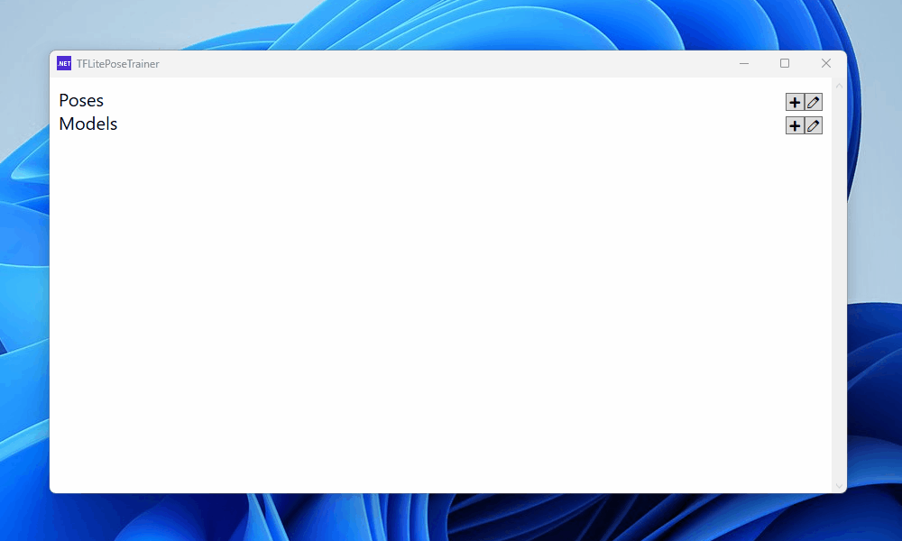
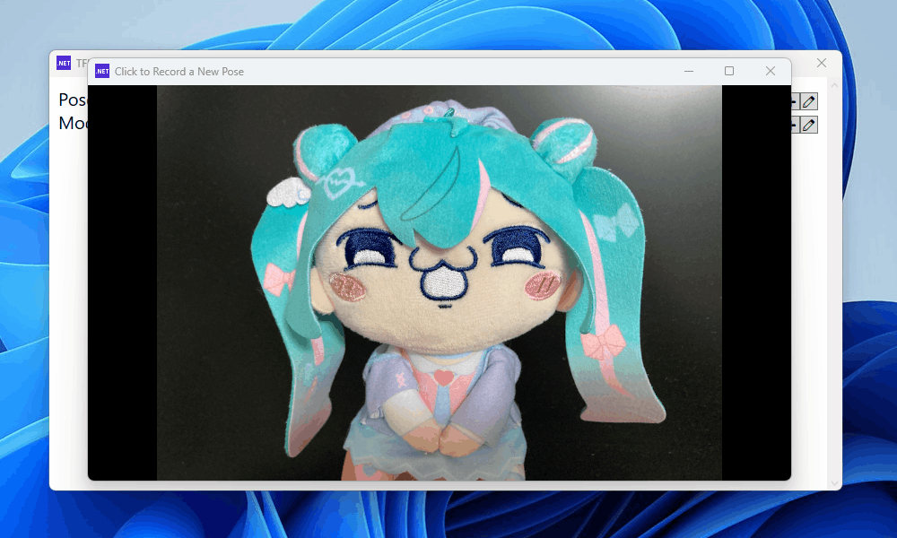
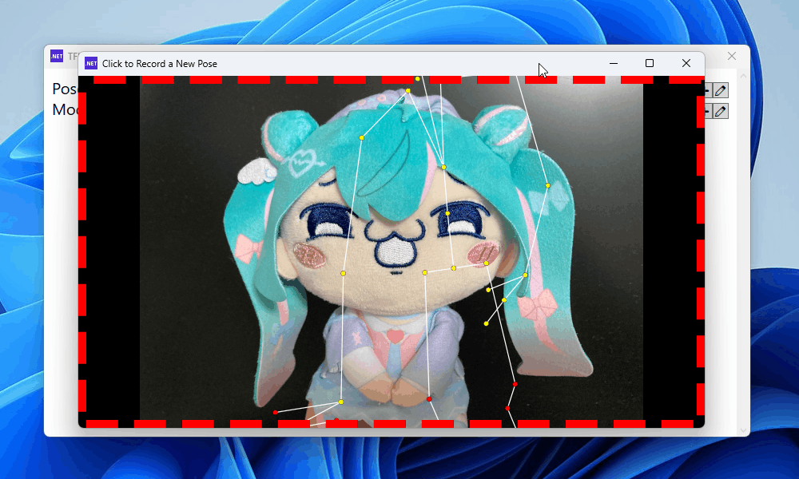
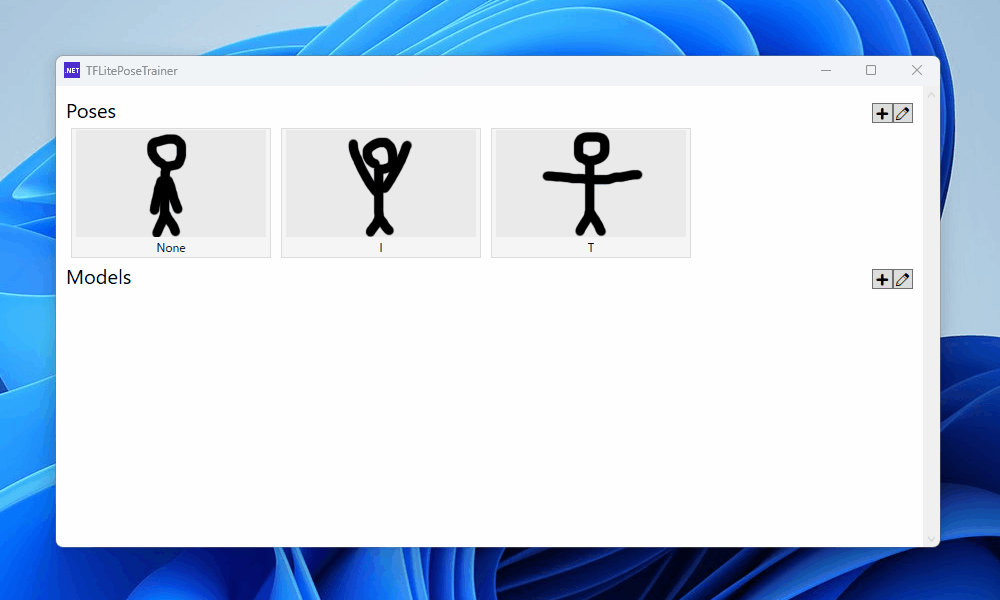
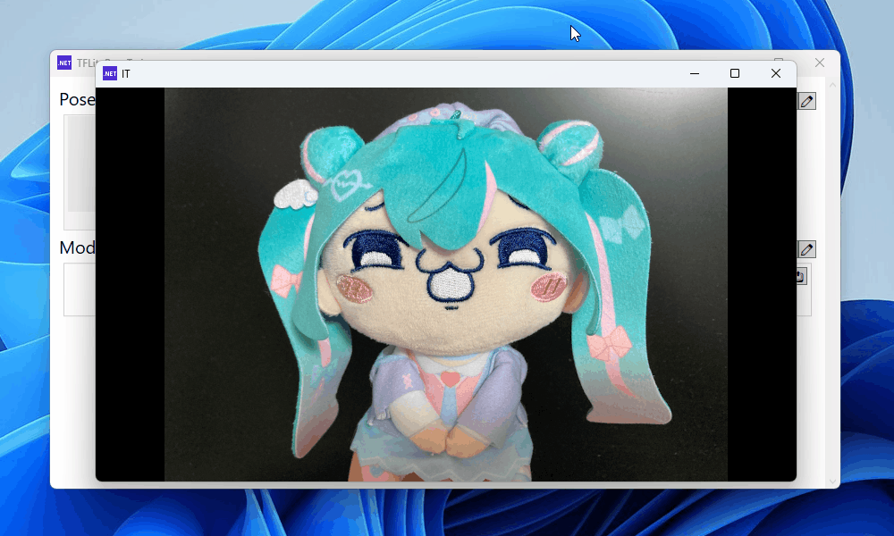

# TFLitePoseTrainer

`TFLitePoseTrainer` is an app to record pose data and create tflite models from the data.
You can classify poses with the created models.

`TFLitePoseTrainer` uses [Azure Kinect](https://azure.microsoft.com/products/kinect-dk) or [Femto Bolt](https://www.orbbec.com/products/tof-camera/femto-bolt/) as a sensor.

## Requirements

- Windows
- [Azure Kinect Body Tracking SDK](https://learn.microsoft.com/azure/kinect-dk/body-sdk-download)
- [Compatible Graphic Card](https://developer.nvidia.com/cuda-gpus) (maybe CC >= 6)
  - You don't have to despair if you don't have this. Body tracking may work if you change `TrackerProcessingMode`.

## Usage

### Record Poses

First, record several poses to be classified.

1. Open Record Window
  

1. Click to Start Recording
  

1. Stay still (but tiny moves are considered good for robustness)
  

Then, a pose item is added.
Repeat these steps.
You might want to edit the label and rename pose items.

### Create Models

After adding enough pose items, create a model to classify poses.

1. Select Recorded Pose Items
  

1. Train a Model
  

Then, a model item is added.
Press export button to save the created model to your desired location.

### Review Models

You can also review how the created model works.

1. Open Review Window
  

1. Move Your Body
  

Then, pose labels are displayed.

## Samples

[/samples](samples) contains sample projects to load created models and classify poses.
