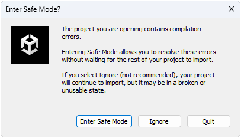
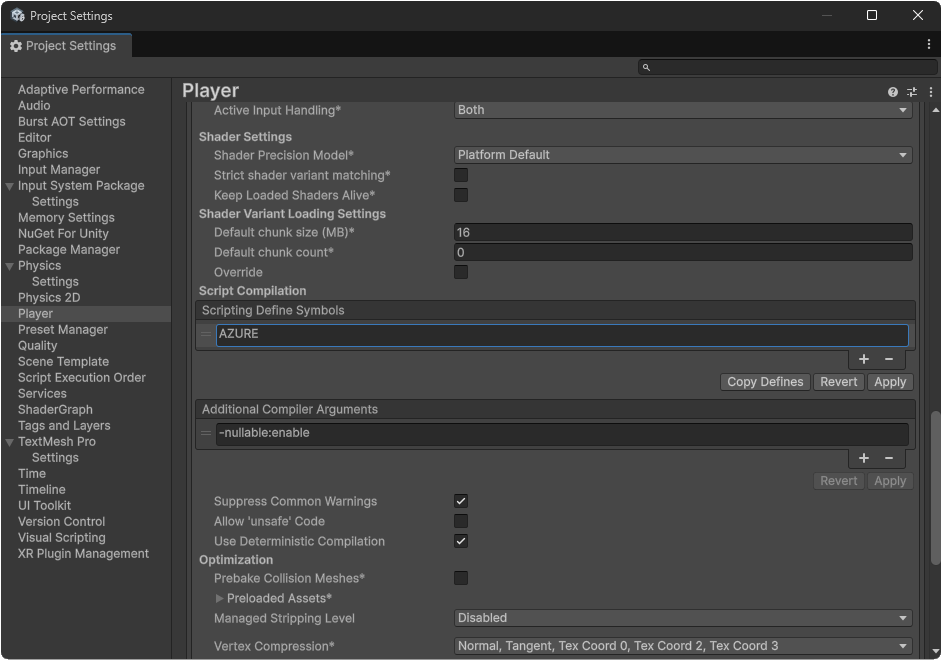

# Unity6 Sample | TFLitePoseTrainer

## Usage

1. Open Model File
1. Move Your Body

## Development

You will be asked if you want to enter safe mode when the first time to open Unity project like:

Just ignore.

### Azure

Add `AZURE` to scripting define symbols (Project Settings -> Player Settings -> Other settings) if you want to use an Azure device.

